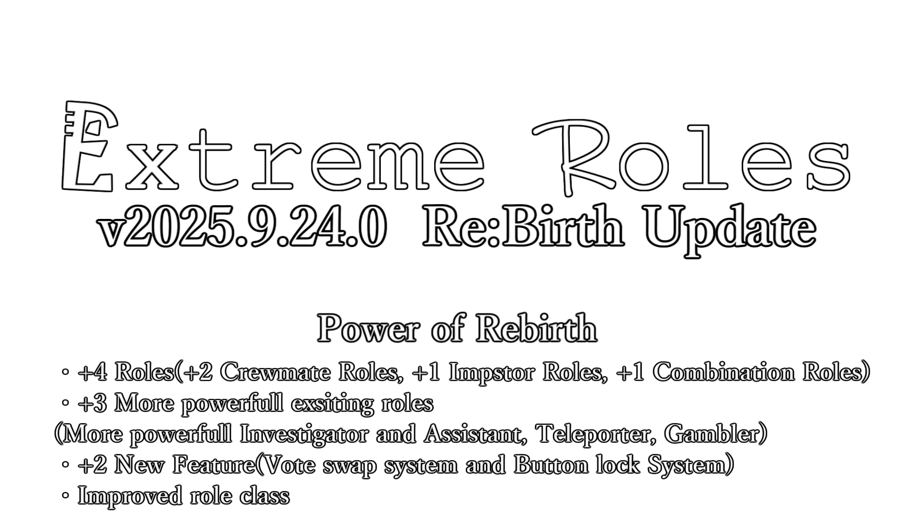

### Quick Link
 - [Latest Release/最新版のダウンロード](https://github.com/yukieiji/ExtremeRoles/releases/latest)
 - [Wiki](https://yukieiji.github.io/ExtremeRoles.Docs/)
 - [How to translate](https://github.com/yukieiji/ExtremeRoles/tree/master?tab=readme-ov-file#how-to-translate)
##### Other Languages README
- [English README](https://github.com/yukieiji/ExtremeRoles/blob/master/doc/en/README.md)
- [SChinese README(WIP)](https://github.com/yukieiji/ExtremeRoles/blob/master/doc/ch_s/README.md)

<h1>Extreme Roles, Extreme Skins and Engine Voice Engine</h1>

Extreme Roles及びExtreme SkinsはAmong UsまたはInnersloth LLCとは提携しておらず、含まれるコンテンツはAmong UsやInnersloth LLCから支援、援助されているものではありません。
ここに含まれる素材の一部は、Innersloth LLCの所有物です。©Innersloth LLC.

-green)

---

## Wikiはこちら => [https://yukieiji.github.io/ExtremeRoles.Docs/](https://yukieiji.github.io/ExtremeRoles.Docs/)

--- 

# Extreme Roles
主な特徴として以下があります 
- 第三陣営「ニュートラル」と幽霊役職の追加
- **100個以上のユニークな役職**の追加
    - すべてのMOD役職がAmongUs公式役職との併用可能
    - すべてのMOD役職が複数人アサイン可能
    - かくれんぼ(HideNSeek)も完全対応しており、MOD役職を使用可能
- **1300個以上**のオプションの追加
    - すべての役職に対して、細かいオプション設定(視界、視界効果、キルクールなど)が実装済み
    - シャッフルの強度、エンジニアのベント調整など多彩なオプションもあります
- 軽量かつ高速な動作
    - 処理によって**重くなることはほぼありません**(他のMODが動作しないようなPCでも軽快な動作が報告されています)
    - 静的解析等を使用したパフォーマンスの最適化や軽量化を随時実施
- 「ロールアサインフィルター」や「アサインウェイト」を使った高度な役職割り当て機能
- MODオプションのインポート/エクスポート機能
- MODの更新/ダウングレード/バージョンチェック機能
- 他のMOD(**サブマージド**等)との高い互換性
    - 互換性のあるMODのインストール/アップデートチェック/アンインストール機能
    - 互換性のあるMODとの専用オプションの実装
- 起動時に問題が発生しても入れ替えなしアップデートすることができるセーフブート機能
- 多言語対応(現在は英語と日本語、简体中文のみ/only English and Japanese, SChinese now!!)
- 多種多様の情報を取得できるREST APIを搭載(欲しいAPIがある場合は連絡をお願いします)

## 追加役職一覧

- Extreme Roles v2025.6.25.0時点、今後も追加予定

### ホスト役職
- シオン

### 通常役職

|  クルー  |  インポスター  | ニュートラル |
| ---- | ---- | ---- |
|  スペシャルクルー  |  スペシャルインポスター  | アリス |
|  シェリフ  |  エボルバー  | ジャッカル |
|  メンテナー  |  キャリアー  | サイドキック |
|  ニート  |  サイコキラー  | タスクマスター |
|  ウォッチドッグ  |  バウンティハンター  | ミッショナリー |
|  スーパーバイザー  |  ペインター  | ジェスター |
|  ボディーガード  |  フェイカー  | ヤンデレ |
|  ウィスパー  |  オーバーローダー  | 妖狐 |
|  タイムマスター  |  クラッカー  | マイナー |
|  エージェンシー  |  ボマー  | イーター |
|  パン屋  |  メリー  | クイーン |
|  カースメーカー  |  スレイヴドライバー  | サーヴァント |
|  フェンサー  |  サンドワーム  | トトカルチョ |
|  オープナー |  スマッシャー  | マッドメイト |
|  カーペンター |  アサルトマスター  | アンブレイヤー |
|  サバイバー |  シューター  | ドール |
|  キャプテン |  ラストウルフ  | ハッター |
|  フォトグラファー |  コマンダー  | アーティスト |
|  デリュージョナー |  ヒプノティスト  | ロォーブレーカー |
|  リザレクター |  アンダーワーパー  |  タッカー |
|  ギャンブラー |  マジシャン  | キメラ |
|  テレポーター |  ゾンビ  | アイアンメイト |
|  モデレーター |  スライム | モニカ |
|  サイキック |  シーフ  | ヘレティック  |
|  ベイト  |  クルーシュルーム  | シェパード |
|  ジェイラー |  テロリスト  | ファーリー |
|  ヤードバード |  レイダー  | インティメイト |
|  サモナー |  グリッチ  | サロゲーター |
|  マーリン  | ハイジャッカー | ナイト  |
|  ヒーロー  | タイムブレーカー  | ポーン |
|  探偵  | スカベンジャー | ヴィジランテ |
|  助手  | アサシン | ワルガキ |
|  見習い探偵  | シェアーズ  | トレイター |
|  バディーズ  | ヴィラン |  |
|  ラバーズ  |  |  |
|  サポーター |  |  |
|  ゲッサー |  |  |
|  ムーバー |  |  |
|  アクセラレーター |  |  |
|  スケーター |  |  |

### 幽霊役職

|  クルー  |  インポスター  | ニュートラル |
| ---- | ---- | ---- |
|  ファウヌス  |  サボり魔  | フォラス |
|  ポルターガイスト  |  ベントガイスト  | ウィスプ |
|  シャッター  |  イグナイター  |  |
|    |  ドッペルゲンガー  |  |

* 「ニート」と「ラバーズ」はオプション設定によりニュートラルにもなります。(デフォルトはクルー)
* 「ラバーズ」、「サポーター」、「ゲッサー」、「ムーバー」、「アクセラレーター」と「スケーター」はオプション設定によりインポスターにもなります。(デフォルトはクルー)
* 「サイドキック」と「見習い探偵」、「サーヴァント」、「ドール」、「ヤードバード」、「ロォーブレーカー」、「キメラ」はゲーム開始時にはアサインされず、条件を満たした時にアサインされます
* 「マーリン」と「アサシン」、「ヒーロー」と「ヴィラン」と「ヴィジランテ」、「探偵」と「助手」、「ワルガキ」と「ウィスプ」は一対の関係です
* 「シェパード」と「ファーリー」、「インティメイト」、「サロゲーター」、「ナイト」、「ポーン」は**フォールバック役職の特定の条件と設定(特定の役職が存在知る等)を行った時にしかアサインされない**
* 「シェパード」と「インティメイト」、「ナイト」は**特定設定を行うことでサブチーム役職となります**
* 詳しくは[Wikiのロール](https://yukieiji.github.io/ExtremeRoles.Docs/docs/%E8%BF%BD%E5%8A%A0%E5%BD%B9%E8%81%B7/%E8%BF%BD%E5%8A%A0%E5%BD%B9%E8%81%B7.html)を参照

# Extreme Skins
Extreme Rolesのコズミック追加用アドオン、主な特徴として以下があります 
- MODの更新/バージョンチェック機能
- 通常スキンに加えてアニメーション可能なスキン「アニメーションスキン」の追加（ハット、バイザーのみ対応）
- 誰でも簡単にハットを追加、テスト可能
- 誰でも簡単にバイザーを追加、テスト可能
- 誰でも簡単にネームプレートを追加、テスト可能
- 誰でも簡単に色の追加テストを可能

### 自分のハットやバイザーを作りたい、作ったハットやバイザーを公開したいという方はTwitter等に連絡下さい！！

# Extreme Voice Engine
Extreme Rolesに読み上げ機能を追加するクライアントアドオン、主な特徴として以下があります 
- 使いたい人だけインストールすれば動作するクライアントアドオン
- 合成音声ソフトを使用した会議チャット等の読み上げ
- 各種音声合成ソフトに対応(各個人でインストールが必要になります。現在はVOICEVOXのみ対応)
   - VOICEVOXの利用規約及び構成等は[公式サイト](https://voicevox.hiroshiba.jp/)等を確認してください
- 各種コマンドによる簡単な操作
   - 詳細はWikiを確認してください

# 現在確認されている不具合
- ExtremeVoiceEngineをインストールし、シオンを使用している状態でシオンのコマンドを使用すると動作しているのに「不正なコマンドである」と表示されてしまう問題
  - この不具合はExtremeVoiceEngineとExtremeRolesで別々のコマンド処理を実装した関係で発生している表示上の問題であるため動作に一切の影響はありません

# リリーススケジュール

## 現在実装検討中の役職及び機能
- 死亡時役職が持つ固有の情報を表示出来るようにする
   - ラバーズ同士、ヤンデレの想い人、各SKやサーヴァントが誰所属なのかを表示出来るようにする
   - 現在(2022/09/06)：計算量や表示方法的にスマートな方法を模索中

- 最終結果表示の拡張
   - 幽霊役職の表示や上記の役職の固有の情報を表示出来るようにしたい
   - 今の最終結果表示だと色々と被って表示されみやすさが悪いため別途仕様を検討中
   - 現在(2022/09/06)：幽霊役職の表示部分はv3.3.0.0で実装、それ以外は上の部分が完成しない限り出来ない

- タスクマスターに第三陣営らしい能力追加
   - 第三陣営らしくクルーとインポスター両方に害がある能力を追加します

# 実装済み機能と役職

|  機能/役職  |  詳細 |  提案者 |  実装バージョン |
| ---- | ---- | ---- | ---- |
|  アサシン会議のインポスターチャット  |  アサシンの特殊会議発生時、インポスターだけが使用できるチャット機能 |  けむりさん |  v1.12.4.0 |
|  ボマー  |  プレイヤーを爆弾にする役職 |  キスミィさん |  v1.18.0.0 |
|  エージェンシー  |  プレイヤーのタスクを肩代わりする役職 |  なりすさん |  v1.18.0.0 |
|  メリー  |  マップ内にインポスターだけ見えて使用できるベントを設置する役職 | 猫野和錆さん |  v1.18.0.0 |
|  パン屋  |  パンが焼けたことを通知する役職 |  なりすさん |  v1.18.0.0 |
|  ヤンデレ  |  片思いの人と同時に勝利を目指す第三陣営 |  シルシラさん |  v1.19.0.0 |
|  スレイヴドライバー  |  タスクをやらないクルーに強いインポスター |  如月ラギさん | v1.19.0.0 |
|  ベントガイスト  |  ベントを動かせるインポスター幽霊役職 |  ふにちかさん |  v2.2.0.0 |
|  サバイバー  |  タスクをやらないと死亡時確定敗北してしまうクルー |  のえぞうさん |  v3.0.0.0 |
|  会議終了後のランダムスポーン  |  会議終了後のスポーン位置選択を自動選択にする |  Nanoさん |  v4.0.1.0 |
|  マジシャン  |  プレイヤーの位置をバラバラにできるインポスター |  なりすさん |  v5.0.0.0 |
|  ギャンブラー  |  投票数がランダムに変化するクルー |  甘造さん |  v7.1.0.0 |
|  ゾンビ  |  復活できるインポスター  |  甘造さん |  v7.1.0.0 |
|  テレポーター  |  2点間を瞬間移動できる「ポータル」を設置できるクルー |  wigさん |  v7.1.0.0 |

# AmongUsとの対応バージョンと最新版のダウンロード
- 最新版のダウンロードは[こちら](https://github.com/yukieiji/ExtremeRoles/releases/latest)から出来ます
- Extreme Roles v(バージョン番号)がスキンなし、Extreme Roles v(バージョン番号) with Extreme Skinsがスキン込みのものになります

|  AmongUs バージョン  |  Extreme Roles バージョン  |
| ---- | ---- |
|  v16.0.5(v2025.5.20)  | v14.0.0.0 ～ v2025.6.25 |
|  v16.0.0(v2025.3.25)/v16.0.2(v2025.3.31)  | v13.0.0.0 ～ v13.1.2.0 |
|  v2024.8.13s/v2024.8.13e/v2024.9.4s/v2024.9.4e v2024.10.29s/v2024.10.29e/v2024.11.26s/v2024.11.26e  | v12.0.0.0 ～ v12.1.5.3 |
|  v2024.6.18s/v2024.6.18e  | v11.0.0.0 ～ v11.1.1.0 |
|  v2024.3.5s/v2024.3.5e  | v10.0.0.0 ～ v10.1.1.1 |
|  v2023.10.28s/v2023.10.28e  | v9.1.0.0 ～ v9.2.3.4 |
|  v2023.10.24s/v2023.10.24e  | v9.0.0.0 ～ v9.0.3.2 |
|  v2023.7.11s/v2023.7.11e/v2023.7.12s/v2023.7.12e  | v8.1.0.0 ～ v8.2.6.2 |
|  v2023.6.13s/v2023.6.13e/v2023.6.27s/v2023.6.27e  | v8.0.0.0 ～ v8.0.0.4 |
|  v2023.3.28s/v2023.3.28e  | v7.0.0.0 ～ v7.1.2.0 |
|  v2023.2.28s/v2023.2.28e  | v6.0.0.0 ～ v6.0.0.6 |
|  v2022.12.08s/v2022.12.08e/v2022.12.14s/v2022.12.14e  |  v5.0.0.0 ～ v5.1.1.1 |
|  v2022.10.25s/v2022.10.25e  |  v4.0.0.0 ～ v4.0.1.4 |
|  v2022.10.18s/v2022.10.18e  |  v3.3.0.3 ～ v3.3.0.6 |
|  v2022.08.23s/v2022.08.23e/v2022.08.24s/v2022.08.24e/v2022.09.20s/v2022.09.20e  |  v3.2.2.5 ～ v3.3.0.2 |
|  v2022.08.23s/v2022.08.23e/v2022.08.24s/v2022.08.24e  |  v3.2.2.0 ～ v3.2.2.4 |
|  v2022.06.21s/v2022.06.22e/v2022.07.12s/v2022.07.12e  |  v3.0.0.0 ～ v3.2.1.4 |
|  v2022.03.29s/v2022.03.29e/v2022.04.19e  |  v2.0.5.0 ～ v2.2.0.2 |
|  v2022.03.29s/v2022.03.29e  |  v1.99.90.0 ～ v2.0.4.0 |
|  v2021.12.15s/v2022.02.08s/v2022.02.23s/v2022.02.24s/v2021.12.15e/v2022.02.24e  |  v1.18.2.0 ～ v1.19.0.0 |
|  v2021.12.15s/v2022.02.08s/v2021.12.15e  |  v1.17.0.0 ～ v1.18.1.0  |
|  v2021.12.15s/v2021.12.15e  |  v1.11.1.1 ～ v1.16.1.0  |

# ビルド方法
- エラー等でビルドできない場合は連絡していただければ対応いたします
- 要求環境
  - VisualStudio 2022
    - 必要なものがあればslnを開いたときにインストールが要求されます
- 環境構築
  1. リポジトリをクローン
  2. ディレクトリをクローンしたディレクトリに移動
  3. 「MakeEnv.bat」を実行
- ビルド
  1. VisualStudio 2022で「ExtremeRoles.sln」を開いてビルドする
     - 必要なものがあればインストールをお願いします
     - 初回のビルドはNugetパッケージの復元が入るので時間がかかります
     - アセット周りがうまく読み込まれない場合は再度ビルドしてみてください

# クレジット&Thanks
- TheOtherRoles - 開発当時から[TOR](https://github.com/Eisbison/TheOtherRoles)及び[TOR-GM](https://github.com/yukinogatari/TheOtherRoles-GM)のコード(ロールに関するところ以外(オプションやパッチ等))を参考、引用、改変して開発しています。TORがなければ開発をこのMODを開発することは不可能でした。また、バウンティハンター、カーペンター、シューター、キャプテンのアイディア元
- [Jackal and Sidekick](https://www.twitch.tv/dhalucard) - **Dhalucard**氏によって作成されたMOD、ジャッカルとサイドキックのアイディア元
- [Sheriff-Mod](https://github.com/Woodi-dev/Among-Us-Sheriff-Mod) - **Woodi-dev**氏によって作成されたMOD、シェリフのアイディア元
- [Among-Us-Love-Couple-Mod](https://www.curseforge.com/among-us/all-mods/love-couple-mod) - **Woodi-dev**氏によって作成されたMOD、ラバーズのアイディア元
- [TooManyRolesMods](https://github.com/Hardel-DW/TooManyRolesMods) - **Hardel-DW**氏によって作成されたMOD、タイムマスターのアイディア元
- [TownOfUs](https://github.com/slushiegoose/Town-Of-Us) - **Slushiegoose**氏によって作成されたMOD、アンブレイヤーのアイディア元
- [Jester](https://github.com/Maartii/Jester) - **Maartii**氏によって作成されたMOD、ジェスターのアイディア元
- [Goose-Goose-Duck](https://store.steampowered.com/app/1568590/Goose_Goose_Duck) - **Slushygoose**氏によって作成されたMOD、イーターのアイディア元
- [PropHunt](https://github.com/ugackMiner53/PropHunt) - **ugackMiner53**氏によって作成されたMOD、スライムとムーバーのコード参考に使用

- [Unity VOICEVOX Bridge](https://github.com/mikito/unity-voicevox-bridge) - **mikito**氏作成のUnityからボイボを呼び出すライブラリ、EVEのボイボ周りの参考に使用
- [CuiCommandParser](https://github.com/oika/CuiCommandParser) - **oika**氏作成のCUIのオプションパーサーライブラリ、EVEのコマンドライン解析の参考に使用
- [UnityMainThreadDispatcher](https://github.com/PimDeWitte/UnityMainThreadDispatcher) - **PimDeWitte**氏作成のUnityのメインスレッド処理をスレッドセーフに行うためのライブラリ、REST APIの処理の参考に使用

- レジスタンス:アヴァロン - マーリン、アサシンのアイディア元
- シャドウハンターズ - アリス、オーバーローダーのアイディア元

- Microsoft.CSharp: dynamic型を使用するために使用
- GAHAG : https://gahag.net/ ボタンを作る際に使用
- Google Font Icons : https://fonts.google.com/icons ApacheLicenceV2、いくつかのアイコンを作るためにいくつか改変を加えて使用
- Google note emoji：https://github.com/googlefonts/noto-emoji 一部のApacheLicenceV2のアイコンを使用しています

- - 効果音ラボ：https://soundeffect-lab.info/ いくつかの役職のSEを使用
- 無料効果音で遊ぼう：https://taira-komori.jpn.org/welcome.html いくつかの役職のSEを使用
- VOICEVOX: https://voicevox.hiroshiba.jp/ いくつかの音声に使用
    - クレジット表記
        - VOICEVOX:ずんだもん

## ボタンのアイコンについて
ボタンのアイコン画像はパブリックドメインの著作権が放棄された素材を元に作成しています。気に食わなくて差し替えたい場合は連絡を下さい

## 多言語対応について(Translation)
多言語対応は出来ますが、実装速度優先で開発しているため日本語が優先的に実装。別の言語に翻訳したいもしくは翻訳したという方は連絡を下さい 
EXRole can support multiple languages, but only Japanese is implemented because I prioritize the speed of implementation. Please contact me if you would like to translate into another language or if you have translated into another language.

- 言語対応状況

|  言語名/Languages  |  対応状況/Status | 翻訳者/Translator(Thank you!!) |
| ---- | ---- | --- |
|  英語/English  |   ほぼ翻訳済み/Mostly Translated  | [yuhgao](https://github.com/yuhgao) |
|  日本語/Japanese  |  完全翻訳済み/Fully Translated  | - |
|  简体中文/SChinese  |   完全翻訳済み/Fully Translated  | [ZeMingoh233](https://github.com/ZeMingoh233) 四个憨批汉化组([fivefirex](https://github.com/fivefirex), 123，乱线Namdam_096，氢氧则名) [小鹿SAMA](https://github.com/ADeerWhoLovesEveryone) |
|  繁体中文/TChinese  |   ほぼ翻訳済み/Mostly Translated  | [FangkuaiYa](https://github.com/FangkuaiYa) |

### How to translate

ExR has been using the `ResX format translation`(XML) system since v11.1.1.0.

You can either edit [the files](https://github.com/yukieiji/ExtremeRoles/tree/master/ExtremeRoles/Translation/resx) as they are or use the [ResXResourceManager](https://github.com/dotnet/ResXResourceManager) to add translations with a few simple operations.

- Use Visual Studio 2022

  1. Clone Repository
      - ExR uses `git-flow`, so please switch to `debelop` branch if possible 
  3. Open `ExtremeRoles.sln` with VisualStudio
      - If VisualStudio component is missing something you need, you will be show to install it, so please follow the instructions.
  4. Open `ResX Resource Manager` in `View` to `Other Windows` of VisualStudio
      - If it's not there, install `ResXManager` from `Manage Extensions` in `Extension` and reboot VisualStudio.
  5. Add or edit translations!!

- ResXResourceManager standalone

  1. Clone Repository(Like /a)
      - ExR uses `git-flow`, so please switch to `debelop` branch if possible 
  3. Download `ResXResourceManager` standalone App : [from](https://github.com/dotnet/ResXResourceManager/releases/latest)
  4. Open `ResXResourceManager.exe`
  5. Set Directory to Cloned path(Like /a/ExtremeRoles)
  6. Add or edit translations!!