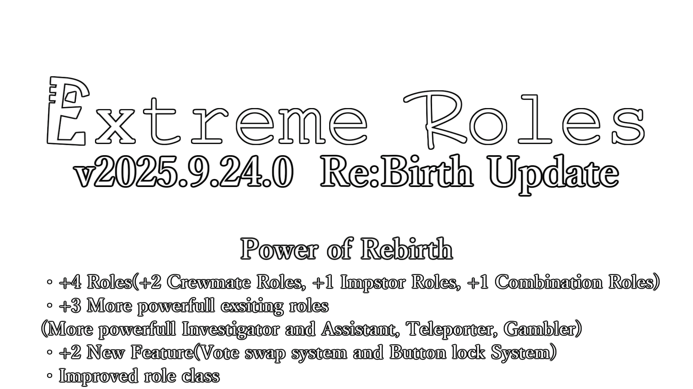

### Lien rapide
 - [Dernière version](https://github.com/yukieiji/ExtremeRoles/releases/latest)
 - [Wiki](https://yukieiji.github.io/ExtremeRoles.Docs/)
 - [Comment traduire](https://github.com/yukieiji/ExtremeRoles/tree/master/doc/en/README.md?tab=readme-ov-file#how-to-translate)

<h1>Extreme Roles, Extreme Skins et Engine Voice Engine</h1>

Ce mod n'est pas affilié à Among Us ni à Innersloth LLC, et le contenu qu'il contient n'est pas approuvé ni sponsorisé par Innersloth LLC. Une partie du matériel contenu ici est la propriété d'Innersloth LLC. © Innersloth LLC.

-green)

---

## Le Wiki est ici => [https://yukieiji.github.io/ExtremeRoles.Docs/](https://yukieiji.github.io/ExtremeRoles.Docs/)

---

## Extreme Roles
Les caractéristiques principales incluent:
- Ajout d'une troisième faction "Neutre", d'une quatrième "Libérale" et de rôles de fantôme.
- **Plus de 100 rôles uniques** ajoutés.
    - Tous les rôles du MOD peuvent être utilisés conjointement avec les rôles officiels d'Among Us.
    - Tous les rôles du MOD peuvent être attribués à plusieurs personnes.
    - HideNSeek est également entièrement pris en charge, et les rôles du MOD peuvent y être utilisés.
- **Plus de 1300 options** ajoutées.
    - Des paramètres d'option détaillés (vision, effets de vision, temps de recharge de kill, etc.) sont implémentés pour tous les rôles.
    - Il existe également diverses options telles que l'intensité du mélange et les ajustements des évents de l'ingénieur.
- Fonctionnement léger et à grande vitesse.
- Prise en charge multilingue.

## Extreme Skins
Un add-on pour ajouter des cosmétiques à Extreme Roles.

## Extreme Voice Engine
Un add-on client qui ajoute une fonction de synthèse vocale à Extreme Roles.

## À propos du support multilingue (Traduction)
- Statut de prise en charge des langues

|  Nom de la langue/Languages  |  Statut | Traducteur/Translator |
| ---- | ---- | --- |
|  Français/French  |  Pris en charge / Fully Translated  | - |
|  Anglais/English  |  Principalement traduit  | [yuhgao](https://github.com/yuhgao) |
|  Japonais/Japanese  |  Entièrement traduit  | - |
|  Chinois simplifié/SChinese  |  Entièrement traduit  | [ZeMingoh233](https://github.com/ZeMingoh233) 四个憨批汉化组([fivefirex](https://github.com/fivefirex), 123，乱线Namdam_096，氢氧则名) [小鹿SAMA](https://github.com/ADeerWhoLovesEveryone) |
|  Chinois traditionnel/TChinese  |  Principalement traduit  | [FangkuaiYa](https://github.com/FangkuaiYa) |
